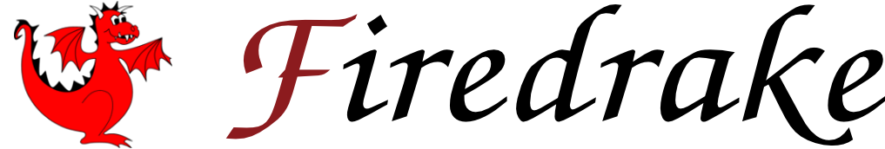
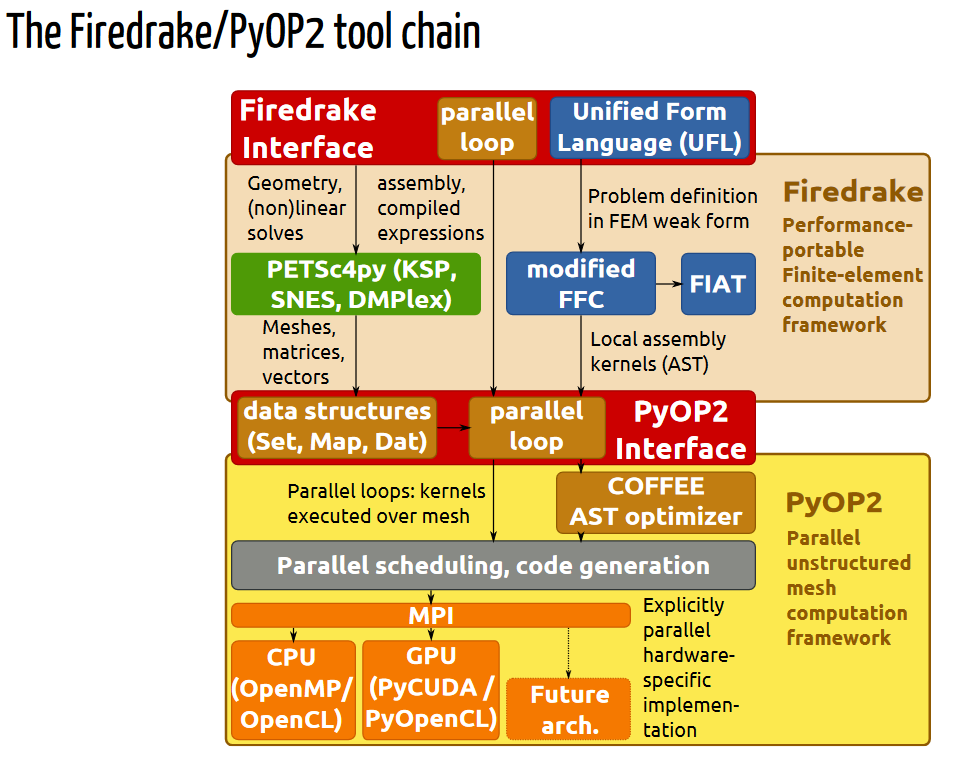

# Community Software Analysis Proposal

## Software: *Firedrake*

Firedrake is described as "an automated system for the solution of partial differential equations (PDE) using the finite element method (FEM)." Firedrake is similar to the FEniCS Project and makes use of their Unified Form Language as a means to specify a wide class of PDEs. This project is built off of PETSc and PyOP2. Firedrake has two layers in which "Layer 1: Firedrake" is the portable high-level finite element problem specification, and "Layer 2: PyOP2" is the parallel solver. The image belows shows this tool chain with the two layer abstraction (from [Firedrake: Re-imagining FEniCS by Composing Domain-specific Abstaction](https://fenicsproject.org/pub/presentations/fenics14-paris/FEniCS14FlorianRathgeber.pdf)).

### Stats

| Description | Your answer |
|---------|-----------|
| Repository URL | https://github.com/firedrakeproject/firedrake |
| Main/documentation website | https://www.firedrakeproject.org/index.html |
| Year project was started | 2013 |
| Number of contributors in the past year | 40 |
| Number of contributors in the lifetime of the project | 93 |
| Number of distinct affiliations | >10 |
| Where do development discussions take place? | GitHub issues |
| Typical number of emails/comments per week? | Not sure! |
| Typical number of commits per week? | ~10 |
| Typical commit size | `git log --shortstat` may be useful |
| How does the project accept contributions? | pull requests |
| Does the project have an automated test suite? | yes |
| Does the project use continuous integration? | yes |
| Are any legal/licensing steps required to contribute? | None that I could find |

### Install and run

Check the following boxes when complete or add a note below if you
encountered a problem.

- [X] I have installed the software
- [X] I have run at least one example
- [X] I have run the test suite
- [X] The test suite passes

### Notes/concerns/risks

I am unaware of any risks following this project. It appears that it should be straightforward making constributions to this project. The only risks I can foresee are associated with my own skills and my ability to make an appropriate contribute. I am excited for my attempt to be contribute to an open-source project like this!

#### Note on copyright
Students retain copyright on any work done in completion of a CU
course, so you are authorized to sign a [contributor license
agreement (CLA)](https://en.wikipedia.org/wiki/Contributor_License_Agreement),
affirm a [developer's certificate of
origin (DCO)](https://en.wikipedia.org/wiki/Developer_Certificate_of_Origin),
etc.  If you have concerns about this, please note them and/or reach
out to Jed directly.
